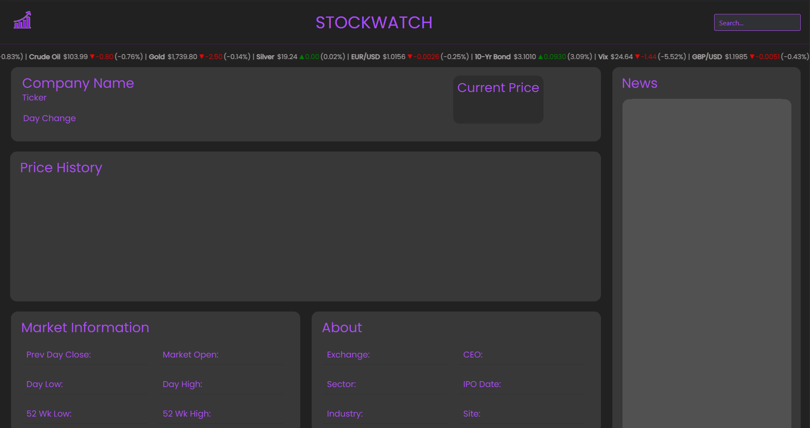

# StockWatch

### [Live Page](https://smandla.github.io/stockwatch/)

## Table of Contents

- [Installation](#installation)
- [Usage](#usage)
- [Credits](#credits)
- [License](#license)

## Description

This site provides an easy-to-navigate dashboard of current stock market data for a searched company along with historical data back 1 year. This includes the day change, the current price, the previous day's close, today's open, the day's high and low, and the 52 week high and low.

General company information includes the exchange, the CEO, the sector, the IPO date, the industry, and a link to the company's website.

A banner of common indexes also scrolls at the top of the page providing a quick refrence for more general market information.

Stock data is drawn from a variety of APIs (see [Credits](#credits))

Alongside the stock market data top headlines for the searched company to provide users with an idea of current events. Currently, this news feed is drawn from the New York Times.

## Installation

Clone repository and run on local machine or use deployed link above

Provide instructions and examples for use. Include screenshots as needed.

## Usage

On page initialization, the page will look like the following:


To use this application, please use search bar to search for either a US based stock ticker or company.  
Upon searching, the webpage will pull information from the Yahoo API to earch for the appropriate ticker/names

```ruby
const getTicker = async (input) => {
  const response = await fetch(
    `https://yfapi.net/v6/finance/autocomplete?region=US&lang=en&query=${input}`,
    {
      headers: {
        "x-api-key": `${yahooAPIKey}`,
      },
    }
  );
  const data = await response.json();
  if (data.ResultSet.Result[0] === undefined) {
    badSearchModalEl.addClass("is-active");
  }
  symbol = data.ResultSet.Result[0].symbol;
  companyName = data.ResultSet.Result[0].name;
  getNewsData(companyName);
  fetchStockRealTime(symbol);
  fetchStockEODHistorical(symbol);
  getInfo(symbol);
}
```

Upon receiving the api call, we parse out the relevant data. Company Name and its respective symbol. We the use that information to call on otehr functions to generate the webpage elements to look like this:


We utilize the information from the Yahoo API to make other API calls to [StockData's API](https://www.stockdata.org/)
(for realtime pricing and market information as well as historical data for the candlestick Chart),
[Finacial Modeling Prep's API](https://site.financialmodelingprep.com/) (for company information in the About Section)
as well as the [New York Times' API](https://developer.nytimes.com/)(News section on the right).
It will also locally keep a record of your recent searches. For the news section on the right, it take information on the right

---

## Credits:

### Created by:

[Kavya Mandla](https://github.com/smandla)  
[Abdur-Rauf Ahmed](https://github.com/Corasinth)  
[Maverick Wong](https://github.com/maverickwong17)

### With the Help of:

[JQuery](https://jquery.com/) |
[Javascript](https://www.javascript.com/) |
[Bulma](https://bulma.io/) |
[Highcharts](https://www.highcharts.com/) |
[Yahoo Finace API](https://www.yahoofinanceapi.com/) |
[StockData API](https://www.stockdata.org/) |
[New York Times API](https://developer.nytimes.com/) |
[Finacial Modeling Prep API](https://site.financialmodelingprep.com/) |
[Figma](https://www.figma.com/) |

### Logo from:

[Tailor Brands](https://www.tailorbrands.com/)

<<<<<<< HEAD

### Documentation:z

[MDN Web docs](https://developer.mozilla.org/en-US/) |
[W3 Schools](https://www.w3schools.com/) |
[Stack Overflow](https://stackoverflow.com/) |

---

## License

=======

### Documentation:

[MDN Web docs](https://developer.mozilla.org/en-US/) |
[W3 Schools](https://www.w3schools.com/) |
[Stack Overflow](https://stackoverflow.com/) |

---

## [License](./LICENSE)

> > > > > > > c2641692fde6d244eede75ed7a480dc9fe3f37ff

MIT License
